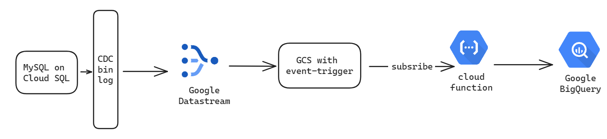

# Near-Real-Time Data Pipeline with MySQL CDC on GCP

This project demonstrates a near-real-time data processing pipeline leveraging MySQL Change Data Capture (CDC) on Google Cloud Platform (GCP). It showcases a real-world data engineering ETL process designed for scalability and manageability.

## Key Features:

**Near-Real-Time Datastreaming**: Extracts data changes from a MySQL database using Google Cloud SQL's CDC binlog and streams them to a data lake in Google Cloud Storage (GCS) in near real-time using Google Datastream.

**Streamlined ETL Processing**: Transforms the data using a Cloud Function, eliminating the need for complex batch processing scripts and reducing stress on production databases.

**Simplified Infrastructure Management**: Terraform automates the provisioning and configuration of all GCP cloud services involved in the pipeline, facilitating infrastructure as code (IaC) practices.

**Centralized Data Warehousing**: Loads the processed data into BigQuery for data warehousing and analysis.

## Untangled some of the most annoying things about GCP resources 

- **Google Cloud Function**: Untangle one of the most annoyed feature of zipping the source code for Cloud Functions (requires the dependency to place outside of `src` folder, `function_v2` remove the "__main__" namespace)

## Benefits

**Reduced Latency**: Data is processed closer to real-time, enabling more timely insights and decision-making.

**Scalability**: The pipeline can be easily scaled to accommodate increasing data volumes.

**Efficiency**: Streamlined ETL processes minimize database load and simplify development.

**Ease of Management**: Terraform configuration simplifies infrastructure provisioning and ongoing maintenance.

## Implementation Stack:

**Google Cloud SQL**: Managed MySQL Database

**Google Cloud Storage (GCS)**: Data Lake for Streaming Data

**Google Datastream**: Streams Data from MySQL CDC Binlog to GCS

**Cloud Functions**: Processes CDC Data in Near-Real-Time

**BigQuery**: Data Warehouse for Analytics

## Data processing:
The data and data processing requirement was obtain using [the challenge by **Data Preppin**](https://preppindata.blogspot.com/2024/01/2024-week-1-prep-airs-flow-card.html)

## Reproduce the project:

***step 0:*** Make sure all `sample.` files was appropriately replaced

1. Clone the project
2. Create a Terraform project with `terraform init`
3. If you are not making changes to the source code, skip to **step 4**. Else, run the command `zip -r function-source.zip requirements.txt $(find src -type f ! -path "src/aaa/*")` to zip the source code to the appropriate format
4. Plan and apply the changes with `terraform plan -var-file="secrets.tfvars"` & `terraform apply -var-file="secrets.tfvars"`
5. After the project running, go the the Cloud SQL dashboard
6. Login the CLI using the command `gcloud sql connect my-mysql-instance --user=root`
7. Create your own table or copy the code from `./airline_tbl.sql`
8. Insert the data and observe the magic 🪄

### ⚠️ Warning:

While this project offers near-real-time functionalities, inherent limitations of **Datastream** can introduce delays of approximately two minutes when reading the CDC binlog. If absolute real-time processing is critical, consider the following alternative stack for enhanced performance:

- **Debezium**: Open-source CDC connector for capturing database changes replacing **Datastream**
- **Apache Kafka** (Data Lake and Cloud Pub/Sub): Serve as a data lake and cloud pub/sub 
- **Apache Flink + Beam** (Real-Time Data Processing and Runtime): Stateful stream processing framework
